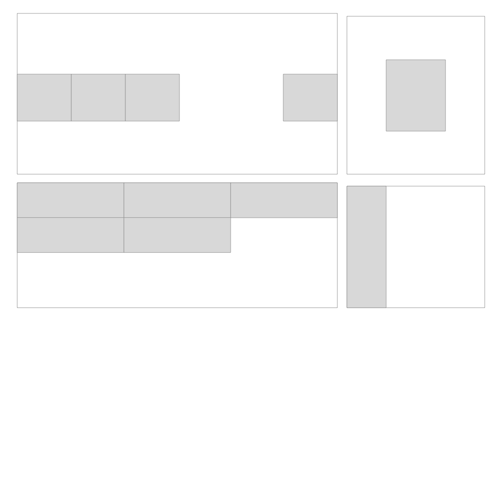

# 6月 第23周

## vscode

## git

## CSS

- CSS哪些属性是可以继承的？
- 盒模型，不同浏览器的默认值（IE、W3C）
- positon: absolute相对于谁定位，fixed相对于谁定义

## flex

- 

## JS

### 数据类型

- 引用数据类型 array object function
- 简单数据类型与引用数据类型两者的差异

### 字符串练习

- 字符串打码

    ```javascript
    var name = '我是一个名字'
    // 输出结果，
    // 如果等于2个字，输出“我*”
    // 如果大于2个字，输出"我********名"，取开头和结尾字符，总长度与输入的一致
    ```

- 找出下面url中的文件名和文件后缀
  > https://www.cnblogs.com/skins/unlimitedsunlight/images/banner.jpg

### 笔记中的8个问题
